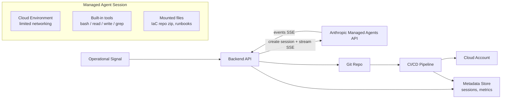

# InfraGuard Agent

**AI-assisted IaC remediation with approval-gated deployments**

Operational signals trigger an agent; the agent diagnoses the issue, proposes code changes, requests human approval, and reports the outcome through a live workflow dashboard.

## Problem

Cloud infrastructure drifts, misconfigures, and accumulates security violations faster than teams can manually review. Common issues like open SSH ingress, missing resource tags, public S3 buckets, and oversized compute waste time and create risk. Manual remediation is slow, error-prone, and hard to audit.

## Solution

InfraGuard Agent uses Claude Managed Agents to automate the detection-to-remediation lifecycle while keeping humans in the loop for safety:

1. **Signal** — An operational alert triggers the workflow (e.g., security group misconfiguration detected)
2. **Analysis** — The agent inspects the IaC repository, identifies the issue, and validates the current state
3. **Proposal** — The agent generates a fix and requests permission to create a PR via a custom tool call
4. **Approval** — A human reviews the proposed change and approves or rejects it
5. **Deployment** — CI/CD validates the change (plan, policy checks, cost diff) and deploys on merge

The agent **never directly changes infrastructure** — it only proposes changes as code. The CI/CD pipeline is the enforcement boundary.

## Architecture

**Key design principle:** The agent sandbox is isolated from credentials. Privileged actions (PR creation, CI triggers) execute on the backend via custom tool calls, not inside the agent container.

## Sample Scenarios

| Scenario | Severity | What the Agent Fixes |
|----------|----------|---------------------|
| Open SSH ingress | Critical | Restricts `0.0.0.0/0` on port 22 to VPN CIDR |
| Missing resource tags | Medium | Adds required `Environment`, `Owner`, `CostCenter` tags |
| Public S3 bucket | High | Enables `block_public_access` and removes public ACL |
| Oversized compute | Low | Right-sizes instance type and adds auto-scaling |

## Terraform Lab

The `terraform-lab/` directory contains intentionally misconfigured Terraform files that serve as test scenarios for the agent. Each subdirectory represents a different type of infrastructure violation.

## Safety Model

- **Agent cannot apply changes** — it only drafts PRs and waits for explicit approval (`requires_action`)
- **Limited container networking** — explicit `allowed_hosts` allowlist
- **Web tools disabled** — `web_search` and `web_fetch` disabled for sensitive runs
- **Credentials outside sandbox** — vault-backed integrations, no secrets in the agent container
- **CI/CD as enforcement boundary** — `terraform plan`, policy checks, and cost estimation run before any merge

## Metrics

| Metric | Description |
|--------|-------------|
| Time to first token (TTFT) | Latency from trigger to first agent response |
| Time to PR | End-to-end from signal to PR opened |
| Auto-fix success rate | % of scenarios successfully remediated |
| Policy block rate | % of PRs blocked by governance checks |
| Cost per run | Agent runtime ($0.08/session-hr) + tokens |

## Tech Stack

- **Agent Runtime:** Claude Managed Agents (Anthropic API)
- **IaC:** Terraform
- **CI/CD:** GitHub Actions
- **Cloud:** AWS
- **Cost Estimation:** Infracost

## Roadmap

- [x] Terraform lab scenarios
- [x] Managed Agents MVP (session streaming + file mount)
- [x] Custom tool layer with approval gate
- [x] IaC review + auto-fix loop (real GitHub PRs)
- [x] CI/CD pipeline + governance-as-code (terraform + trivy + infracost)
- [x] Live demo UI + metrics dashboard
- [x] Drift detection against real cloud state (boto3 read-only scanner, surface-only)
- [x] **End-to-end validation against a real AWS account** (May 2026 — see below)
- [ ] Iterative fix loop: agent pushes follow-up commits to the same PR branch
- [ ] Policy-as-feedback: CI failures feed structured signals back into the agent

## Validation

The full loop was exercised against a real AWS sandbox in May 2026 — not just unit tests against
moto stubs. Setup walkthrough lives in [`docs/aws-setup.md`](docs/aws-setup.md); the apply
helper is at [`terraform-lab/apply-lab.sh`](terraform-lab/apply-lab.sh).

**What ran end-to-end:**

1. Two IAM users provisioned with least-privilege boundaries — `infraguard-tf` (PowerUserAccess
   for terraform) and `infraguard-scanner` (a 9-action read-only inline policy for boto3).
2. Three lab scenarios applied via Terraform (`open-ssh`, `missing-tags`, `public-s3`).
3. The boto3 scanner detected **9 live findings** in a single scan — six from lab resources,
   three pre-existing collateral findings on unrelated S3 buckets.
4. Clicking **Remediate** on the open-ssh finding kicked off a Managed Agent session that
   diagnosed the misconfiguration, drafted a Terraform change, paused at the approval gate,
   opened a real PR on the lab repo, and watched CI run (terraform + trivy + infracost).

**What live validation surfaced that mocks couldn't:**

- **Stale hardcoded AMI:** `missing-tags/main.tf` had `ami-0c55b159cbfafe1f0` (a 2018 us-west-2
  AMI that doesn't exist in us-east-1 today). Replaced with an SSM-parameter data source for
  Amazon Linux 2023 so the scenario stays valid as AMIs rotate.
- **No default VPC on modern AWS accounts:** new accounts since late 2022 don't auto-create
  one. `aws ec2 create-default-vpc` once per account.
- **Post-2023 S3 hardening is three layers deep:** account-level Block Public Access +
  bucket-level BPA + `BucketOwnerEnforced` ownership all default to ON. The public-ACL
  violation in the original `public-s3` scenario couldn't even be created. Reduced the
  scenario to the "missing bucket-level PAB" violation, which the scanner detects via
  `NoSuchPublicAccessBlockConfiguration` and the agent fixes with a real IaC resource —
  closer to how this is remediated in practice anyway.
- **pydantic-settings doesn't propagate to `os.environ`:** boto3 reads creds from the
  process environment, not from the Settings object. `.env` values for `AWS_ACCESS_KEY_ID`
  were silently invisible until `load_dotenv()` was called explicitly in `config.py`.
- **Compounding rough edges in the agent loop:** Trivy flagged a different CRITICAL on the
  agent's first fix (`AWS-0104` — unrestricted egress). The agent tried to push a follow-up
  commit, but `repo_create_branch_and_commit` always branches from base, so the retry
  landed on a sibling branch → opened a sibling PR instead of amending the original. This
  validates both Phase 4 work items as real, demonstrable rough edges rather than
  speculative ones. They're now the top priorities.

## License

MIT
