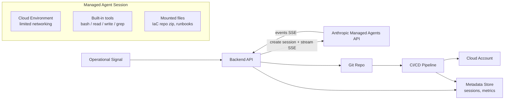

# InfraGuard Agent

**AI-assisted IaC remediation with approval-gated deployments**

Operational signals trigger an agent; the agent diagnoses the issue, proposes code changes, requests human approval, and reports the outcome through a live workflow dashboard.

## Problem

Cloud infrastructure drifts, misconfigures, and accumulates security violations faster than teams can manually review. Common issues like open SSH ingress, missing resource tags, public S3 buckets, and oversized compute waste time and create risk. Manual remediation is slow, error-prone, and hard to audit.

## Solution

InfraGuard Agent uses Claude Managed Agents to automate the detection-to-remediation lifecycle while keeping humans in the loop for safety:

1. **Signal** — An operational alert triggers the workflow (e.g., security group misconfiguration detected)
2. **Analysis** — The agent inspects the IaC repository, identifies the issue, and validates the current state
3. **Proposal** — The agent generates a fix and requests permission to create a PR via a custom tool call
4. **Approval** — A human reviews the proposed change and approves or rejects it
5. **Deployment** — CI/CD validates the change (plan, policy checks, cost diff) and deploys on merge

The agent **never directly changes infrastructure** — it only proposes changes as code. The CI/CD pipeline is the enforcement boundary.

## Architecture

**Key design principle:** The agent sandbox is isolated from credentials. Privileged actions (PR creation, CI triggers) execute on the backend via custom tool calls, not inside the agent container.

## Sample Scenarios

| Scenario | Severity | What the Agent Fixes |
|----------|----------|---------------------|
| Open SSH ingress | Critical | Restricts `0.0.0.0/0` on port 22 to VPN CIDR |
| Missing resource tags | Medium | Adds required `Environment`, `Owner`, `CostCenter` tags |
| Public S3 bucket | High | Enables `block_public_access` and removes public ACL |
| Oversized compute | Low | Right-sizes instance type and adds auto-scaling |

## Terraform Lab

The `terraform-lab/` directory contains intentionally misconfigured Terraform files that serve as test scenarios for the agent. Each subdirectory represents a different type of infrastructure violation.

## Safety Model

- **Agent cannot apply changes** — it only drafts PRs and waits for explicit approval (`requires_action`)
- **Limited container networking** — explicit `allowed_hosts` allowlist
- **Web tools disabled** — `web_search` and `web_fetch` disabled for sensitive runs
- **Credentials outside sandbox** — vault-backed integrations, no secrets in the agent container
- **CI/CD as enforcement boundary** — `terraform plan`, policy checks, and cost estimation run before any merge

## Metrics

| Metric | Description |
|--------|-------------|
| Time to first token (TTFT) | Latency from trigger to first agent response |
| Time to PR | End-to-end from signal to PR opened |
| Auto-fix success rate | % of scenarios successfully remediated |
| Policy block rate | % of PRs blocked by governance checks |
| Cost per run | Agent runtime ($0.08/session-hr) + tokens |

## Tech Stack

- **Agent Runtime:** Claude Managed Agents (Anthropic API)
- **IaC:** Terraform
- **CI/CD:** GitHub Actions
- **Cloud:** AWS
- **Cost Estimation:** Infracost

## Roadmap

- [x] Terraform lab scenarios
- [x] Managed Agents MVP (session streaming + file mount)
- [x] Custom tool layer with approval gate
- [x] IaC review + auto-fix loop (real GitHub PRs)
- [x] CI/CD pipeline + governance-as-code (terraform + trivy + infracost)
- [x] Live demo UI + metrics dashboard
- [x] Drift detection against real cloud state (boto3 read-only scanner, surface-only)

## License

MIT
